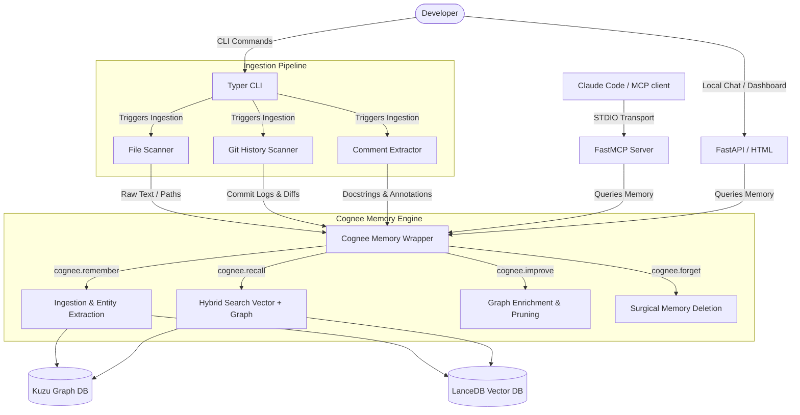

# DevMind Architecture Design

This document details the software architecture, module layout, and interface designs for **DevMind – Codebase Memory for Developers**. It serves as our blueprint for implementation once the hackathon officially starts.

---

## 1. System Overview

DevMind integrates five core layers to build a persistent memory graph of a codebase:
1. **CLI Layer (Typer)**: Entrypoint for the developer to run memory lifecycle operations.
2. **Ingestion Layer (GitPython/AST/Parsers)**: Parses files, git commit history, and code comments.
3. **Memory Wrapper Layer (Cognee)**: Direct integration with Cognee's four core lifecycle APIs (`remember`, `recall`, `improve`, `forget`).
4. **Integration Layer (FastMCP)**: A Model Context Protocol server exposing the codebase graph to Claude Code or Cursor.
5. **Web UI Layer (FastAPI)**: A lightweight interactive local dashboard and chat interface.



---

## 2. Component Design & Pseudocode

### A. Memory Wrapper: `memory.py`

This module wraps all Cognee API interactions. It configures the local Vector and Graph database engines, embedding models (Fastembed), and the LLM (Groq).

```python
# Pseudocode blueprint for devmind/memory.py

import os
import cognee
from dotenv import load_dotenv

def initialize_cognee():
    """
    Loads .env settings and configures Cognee to run locally 
    with LanceDB (vector), Kuzu (graph), and Fastembed (embeddings).
    """
    load_dotenv()
    
    # Configure Cognee programmatically or ensure environment variables are present:
    # OS env variables:
    # - LLM_PROVIDER="groq"
    # - LLM_API_KEY="gsk_..."
    # - LLM_MODEL="groq/llama-3.3-70b-versatile"
    # - EMBEDDING_PROVIDER="fastembed"
    # - EMBEDDING_MODEL="BAAI/bge-small-en-v1.5"
    # - EMBEDDING_DIMENSIONS="384"
    pass

async def remember_file(file_path: str, content: str):
    """
    Feeds a specific file's content into Cognee memory under a dedicated dataset name.
    We name the dataset after the file path to support surgical forget later.
    """
    # Clean the path to act as a valid dataset name
    dataset_name = file_path.replace("/", "_").replace("\\", "_").replace(".", "_")
    await cognee.remember(
        content,
        dataset_name=dataset_name
    )

async def recall_question(query: str) -> str:
    """
    Queries the knowledge graph and vector store for an answer.
    """
    results = await cognee.recall(query_text=query)
    # Process and format the results returned by Cognee
    if not results:
        return "No relevant codebase memory found."
    return "\n".join([str(res) for res in results])

async def improve_file_memory(file_path: str):
    """
    Performs memory enrichment for a specific file's dataset.
    """
    dataset_name = file_path.replace("/", "_").replace("\\", "_").replace(".", "_")
    await cognee.improve(dataset=dataset_name)

async def forget_file_memory(file_path: str):
    """
    Surgically deletes the memory associated with a specific file.
    """
    dataset_name = file_path.replace("/", "_").replace("\\", "_").replace(".", "_")
    await cognee.forget(dataset_name=dataset_name)
```

---

### B. Ingestion Pipeline

The ingestion layer extracts content from different parts of the workspace.

#### 1. File Reader: `file_reader.py`
Scans directories, respects `.gitignore`, and reads text contents of code, documentation, and config files.

```python
# Pseudocode blueprint for devmind/ingestion/file_reader.py

import pathlib

def scan_files(directory: str) -> dict[str, str]:
    """
    Walks the directory recursively. Filters out:
    - Directories: .git, __pycache__, .venv, .cognee_store, node_modules
    - Files: Binary formats, large log files, images
    Returns a dictionary of {file_path: file_content}.
    """
    results = {}
    path = pathlib.Path(directory)
    # Recurse and parse text files
    return results
```

#### 2. Git Parser: `git_parser.py`
Leverages `GitPython` to extract commit information, commit messages, and diff summaries. This provides a temporal dimension to the memory graph.

```python
# Pseudocode blueprint for devmind/ingestion/git_parser.py

from git import Repo

def parse_git_commits(repo_path: str, max_commits: int = 50) -> list[dict]:
    """
    Reads recent commits from the repository.
    Extracts:
    - Author & Date
    - Commit hash
    - Commit message
    - Changed files & summary of changes
    Returns list of parsed commit metadata dictionaries.
    """
    repo = Repo(repo_path)
    commits_data = []
    # Fetch log details
    return commits_data
```

#### 3. Comment Extractor: `comment_extractor.py`
Parses inline comments (`# TODO`, `// FIXME`) and docstrings to capture developers' intent and architectural explanations embedded in code.

```python
# Pseudocode blueprint for devmind/ingestion/comment_extractor.py

import ast

def extract_comments_and_docstrings(file_content: str, file_path: str) -> list[dict]:
    """
    Parses code using python AST (or regex for non-python files).
    Extracts docstrings from classes/functions, and tags inline comments (TODO, FIXME, NOTE).
    """
    # Return a list of dictionaries with structure:
    # {"type": "todo/docstring/comment", "content": "text", "line": line_no}
    return []
```

---

### C. Typer CLI: `cli.py`

Maps developer commands to the ingestion and memory wrapper workflows.

```python
# Pseudocode blueprint for devmind/cli.py

import typer
import asyncio
from devmind.memory import initialize_cognee, remember_file, recall_question

app = typer.Typer(help="DevMind: Codebase Memory for Developers")

@app.command()
def remember(directory: str = "."):
    """Scan and remember the entire codebase (files, git history, and comments)."""
    initialize_cognee()
    # 1. Scan files
    # 2. Extract git log
    # 3. Extract comments
    # 4. Run asyncio.run(remember_file(...)) for each item
    typer.echo("✅ Codebase memory successfully built.")

@app.command()
def ask(query: str):
    """Query the codebase memory in plain English."""
    initialize_cognee()
    answer = asyncio.run(recall_question(query))
    typer.echo(answer)

@app.command()
def log(decision: str):
    """Save an Architectural Decision Record (ADR) into memory."""
    initialize_cognee()
    # Call remember with a decision dataset
    typer.echo("✅ Architectural decision recorded.")
```

---

### D. Claude Code MCP Server: `claude_code.py`

Enables automated, bidirectional context communication with Claude Code via the Model Context Protocol (MCP).

```python
# Pseudocode blueprint for devmind/integrations/claude_code.py

from fastmcp import FastMCP
import asyncio
from devmind.memory import recall_question, remember_file

mcp = FastMCP("DevMind Memory Server")

@mcp.tool
async def query_codebase_memory(query: str) -> str:
    """
    Query the persistent knowledge graph for architectural context,
    past bugs, git details, or decision records.
    """
    return await recall_question(query)

@mcp.tool
async def log_decision_record(decision: str) -> str:
    """
    Log an architectural decision, reasoning, or configuration change.
    """
    await remember_file("adr_log.md", f"Architectural Decision: {decision}")
    return "Decision logged successfully."

if __name__ == "__main__":
    mcp.run()
```

---

### E. Web UI: `app.py` & `index.html`

Provides a local FastAPI dashboard to view memory status, query the codebase interactively, and check the decision logs.

```python
# Pseudocode blueprint for devmind/web/app.py

from fastapi import FastAPI, Request
from fastapi.templating import Jinja2Templates
from fastapi.responses import HTMLResponse
from devmind.memory import recall_question

app = FastAPI()
templates = Jinja2Templates(directory="devmind/web/templates")

@app.get("/", response_class=HTMLResponse)
async def read_dashboard(request: Request):
    # Fetch status (number of files remembered, recent decisions)
    return templates.TemplateResponse("index.html", {"request": request})

@app.post("/chat")
async def chat_query(data: dict):
    query = data.get("query")
    answer = await recall_question(query)
    return {"answer": answer}
```
